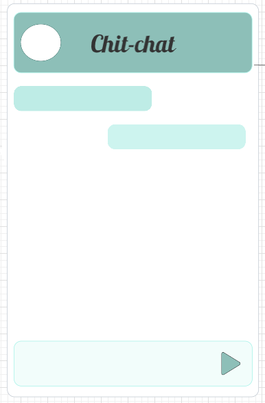

# Chit-Chat

## Description

Chit-Chat is a mern website created to connect users in real time text message conversations.

## Expected Behavior

as a user when I enter the URL address: 

I want to enter my username and password to sign in. 

Then I'm presented a list of my contacts.

I want to be able to click on a name to send messages to that contact.

When the text message window opens I want to see a self explanatory and easy to use interface.

The main site shows my picture and name on the header.

Also there is an input text box next to a send message button in the footer.

## Wireframe 

